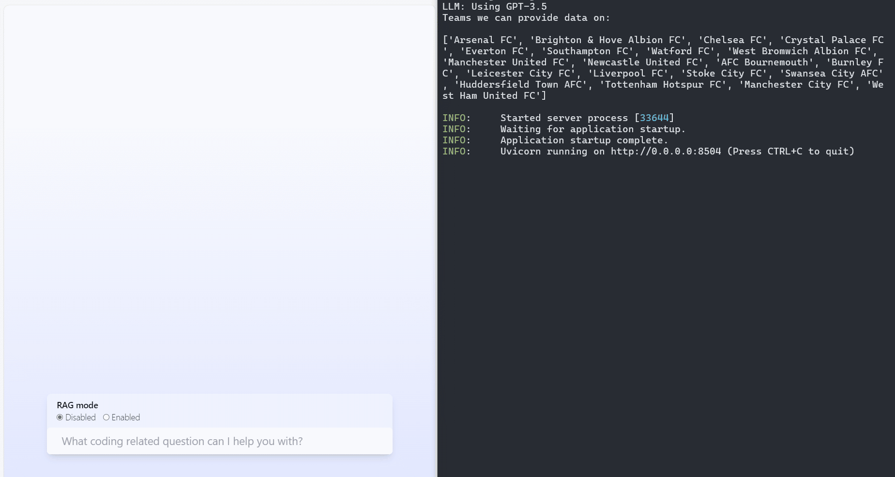

# Pundit Bot

> ![NOTE]
> This project is a training exercise in learning LangChain, LLMs, Prompt Engineering, Neo4J, Python and Docker. Do not expect this repository to be kept well maintained.

Pundit Bot is an AI ChatBot project. It's just like ChatGPT, but gives more specific and accurate information on English-league football.

For running the project locally see [the set up guide](SETUP.md).

### Current capabilities

- Report on games stored in the Neo4J knowledge graph. Currently only reports on games in the 2017/18 season.

### Potential capabilities

- Return nicely rendered front-end views of game results.
- Get and show highlights from the mentioned games through web searches.
- Give more general knowledge on clubs, players or the english football league.

### Acknowledgements

- [atriantus](https://github.com/atriantus)' [Neo4J graph of EPL data repo](https://github.com/atriantus/Neo4j-Graph-for-EPL-data) for the initial data and scheme for the Neo4J knowledge graph.
- The [Docker GenAI stack repo](https://github.com/docker/genai-stack) for the general AI ChatBot structure.
- Art used taken from [here](https://www.freepik.com/icon/businessman_5717368#fromView=resource_detail&position=18) and [here](https://www.123rf.com/photo_110071527_soccer-referee-icon-over-white-background-vector-illustration.html)
